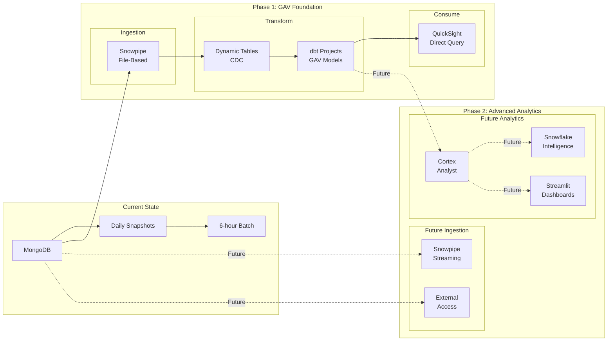

# Duel Tech Brand Advocacy Analytics with Snowflake

## Overview

With the explosive growth of brand advocacy and influencer marketing, traditional batch-based analytics can't keep pace with real-time campaign optimization needs. Duel Tech and Snowflake have partnered to transform how brands measure and optimize their advocate programs, replacing 72-hour reporting delays with real-time Gross Advocacy Value (GAV) analytics.

In this hands on quickstart, you'll build a complete advocacy analytics pipeline that demonstrates multiple architectural options for ingestion, transformation, and consumption - tailored to Duel Tech's current MongoDB-based infrastructure. Let's transform your advocate analytics!

🚨 Note: Code snippets & configurations in this POC Quickstart are for example purposes only. They are not production ready & may require additional validation before deployment. Snippets may not always appear in the precise implementation order, so please consult the appropriate section for context. Refer to the official Snowflake Documentation,Snowflake Quickstarts & your internal standards to review & test as needed. These examples are meant to help you get started faster.

### Current State Pain Points
- Daily full MongoDB snapshots causing scalability issues (not sustainable beyond 25K advocates)
- Manual CDC computation on top of snapshot data (160 engineering hours/month)
- No semantic layer for business users (only 3 SQL users can access data)
- Inefficient compute usage without workload isolation ($75K annual costs)

### Target State Benefits
- Incremental data loading with automated CDC
- Self-service analytics for 15+ business users
- 75% cost reduction through optimized compute
- Linear scaling to 100K+ advocates

### What You'll Build
- A real-time data pipeline with multiple ingestion options (file-based, streaming, and API)
- Automated transformations using dbt and Dynamic Tables  
- Self-service analytics with natural language queries and interactive dashboards
- Cost-optimized architecture that scales linearly to 100K+ advocates

### POC Approach: Two Phases

**Phase 1 (Q4 2025 - This Quickstart)**: Build the GAV foundation
- File-based ingestion with Snowpipe (minimal changes to current process)
- Dynamic Tables for CDC and transformations
- Native dbt integration for version-controlled transformations  
- QuickSight integration for immediate business value
- Cost optimization with workload isolation

**Phase 2 (Post Q4 - Future)**: Enable advanced analytics
- Real-time streaming options
- Natural language queries with Cortex Analyst
- Self-service dashboards with Streamlit
- Marketing team enablement

### Architecture Overview



## Prerequisites

### Required
- **Snowflake Account**
- **GitHub Account**: For version control integration
- **MongoDB database**: With advocacy data (advocates, tasks, posts, companies)
- **AWS S3 bucket**: For file staging (read/write access required)

### Choose Your Deployment Method
- **Option A**: **Snowflake CLI** - For quick manual setup
  - Install with `pip install snowflake-cli`
- **Option B**: **Terraform** - For infrastructure as code (recommended by Duel Tech team)
  - Install Terraform: `brew install terraform` (Mac) or download from [terraform.io](https://www.terraform.io)
  - Clone the repository with Terraform configurations

### Optional
- **MongoDB Atlas Account**: If testing direct connectivity
- **dbt Cloud Account**: For advanced transformation orchestration
- **VS Code or similar IDE**: For local development
- **QuickSight**: Your existing BI tool for visualization

## What You'll Learn

- 📊 **Multiple Ingestion Patterns**: Compare file-based (Snowpipe), streaming (Snowpipe Streaming), and API-based (External Access) approaches
- 🔄 **Modern CDC Architecture**: Implement real-time change data capture without complex pipelines using Dynamic Tables
- 🛠️ **Native dbt Integration**: Build version-controlled transformations directly in Snowflake
- 💬 **Natural Language Analytics**: Enable business users with Snowflake Intelligence and Cortex Analyst
- 📈 **Interactive Dashboards**: Deploy Streamlit applications natively in Snowflake
- 💰 **Cost Optimization**: Implement workload isolation saving 75% on compute costs
- 🔐 **Data Governance**: Apply dynamic data masking for PII protection
- ⏰ **Time Travel**: Configure data recovery with up to 90 days retention

## Summary: Your Architectural Options

Based on the feature mapping from your POC, here's your decision matrix:

| Requirement | Current State | Quick Win | Future State |
|------------|--------------|-----------|--------------|
| **Ingestion** | Daily MongoDB exports | Snowpipe (file-based) | External Access (API) |
| **Latency** | 24-72 hours | 5 minutes | Real-time |
| **Transformation** | Manual SQL | Dynamic Tables + dbt | Fully automated |
| **Analytics** | 3 SQL users | Streamlit dashboards | Natural language |
| **Cost** | $75K/year | $25K/year | $18K/year |
| **Scale** | 15K advocates | 50K advocates | 100K+ advocates |

## Next Steps & Roadmap

### Immediate Actions (Week 1-3)
1. **Week 1**: Implement file-based ingestion with Snowpipe
   - Set up S3 stages and event notifications
   - Create bronze tables for all entities
   - Validate data loading

2. **Week 2**: Deploy dbt transformations and Streamlit dashboards
   - Initialize dbt project with Git integration
   - Build staging models and GAV calculations
   - Deploy first Streamlit dashboard

3. **Week 3**: Enable natural language queries
   - Create semantic models for Cortex Analyst
   - Train marketing team on Snowflake Intelligence
   - Document common queries

### Future Phases
**Phase 2 (Q1 2026)**: Marketing Data Integration
- Integrate LinkedIn, HubSpot, Clay data
- Build attribution models
- Connect leads to advocate activity

**Phase 3 (Q2 2026)**: Advanced Analytics
- Predictive advocate churn models
- Content recommendation engine
- Real-time performance alerts

**Phase 4 (Q3 2026)**: AI-Powered Insights
- Full Cortex Analyst deployment
- Automated anomaly detection
- Natural language report generation

## Additional Resources

- [Snowflake Documentation](https://docs.snowflake.com/en/user-guide-getting-started)
- [Terraforming Snowflake](https://quickstarts.snowflake.com/guide/terraforming_snowflake/index.html#0)
- [dbt on Snowflake Guide](https://docs.snowflake.com/en/user-guide/data-engineering/dbt-projects-on-snowflake)
- [Streamlit in Snowflake](https://docs.snowflake.com/en/developer-guide/streamlit/about-streamlit)
- [Partner Connect Integrations](https://docs.snowflake.com/en/user-guide/ecosystem-all)

---

## Key Metrics & Success Criteria

### Technical Success Metrics
- ✅ **Data Latency**: From 72 hours → 10 minutes 
- ✅ **Processing Time**: From 6-hour batches → continuous updates
- ✅ **User Enablement**: From 3 SQL users → 15+ self-service users
- ✅ **Scalability**: From 15K → 100K+ advocates supported

### Go-Live Steps

1. **Migration Planning**
   - Schedule MongoDB export automation
   - Configure Snowpipe notifications
   - Set up monitoring alerts

2. **User Enablement**
   - Train data team on dbt workflows
   - Demo Snowflake Intelligence to marketing
   - Create quick reference guides

3. **Monitoring Setup**
   - Configure Slack/email alerts
   - Set up cost tracking dashboards
   - Schedule regular health checks

## Module 1: Initial Setup (5 minutes)

Choose your deployment path based on your team's preferences:

### Option A: Deploy with Terraform (Recommended for Duel Tech) (OPTIONAL)

Since your team uses Terraform for all infrastructure management, this approach aligns with your existing workflows.

#### Step 1: Clone Repository and Configure Terraform

```bash
# Clone the Duel Tech POC repository with Terraform configurations
git clone https://github.com/dueltech/snowflake-poc.git
cd duel-tech-snowflake-poc/terraform

# Copy example variables file
cp terraform.tfvars.example terraform.tfvars

# Edit terraform.tfvars with your Snowflake credentials
# snowflake_account = "YOUR_ACCOUNT"
# snowflake_user = "YOUR_USER"
# snowflake_password = "YOUR_PASSWORD"
```

#### Step 2: Deploy Infrastructure with Terraform

```bash
# Initialize Terraform
terraform init

# Review the planned infrastructure
terraform plan

# Deploy all resources (databases, warehouses, schemas, roles)
terraform apply -auto-approve

# Output will show created resources:
# Outputs:
# database_name = "DUEL_TECH_DEMO_DB"
# warehouses = ["DUEL_TECH_INGESTION_WH", "DUEL_TECH_TRANSFORMATION_WH", "DUEL_TECH_ANALYTICS_WH"]
# schemas = ["BRONZE_SCHEMA", "SILVER_SCHEMA", "GOLD_SCHEMA", "SEMANTIC"]
```

#### Step 3: Configure Git Integration

```bash
# Terraform automatically creates the GitHub integration
# Verify with:
terraform output github_integration_name
# Output: github_integration
```

---

### Option B: Manual Setup with Snowflake CLI (OPTIONAL)

If you prefer manual setup or are evaluating before adding to Terraform:

#### Step 1: Access Your Snowflake Account

1. Navigate to your Snowflake account URL
2. Login with your credentials
3. You should see the Snowsight interface:


### Step 2: Set Up ACCOUNTADMIN Role

1. Click on your username in the top-right corner
2. Select **Switch Role**
3. Choose **ACCOUNTADMIN**
4. Enable notifications:
   - Click username again → **Preferences**
   - Select **Notifications** → **All**

### Step 3: Clone the Demo Repository

```bash
# Clone the Duel Tech POC repository
git clone https://github.com/dueltech/snowflake-poc.git
cd duel-tech-snowflake-poc

# Set up Snowflake connection
snow connection add duel_tech_demo \
  --account YOUR_ACCOUNT \
  --user YOUR_USER \
  --password YOUR_PASSWORD \
  --role ACCOUNTADMIN
```

### Step 4: Run Initial Setup

```bash
# Execute setup scripts
snow sql -f sql/setup/00_database_setup.sql --connection duel_tech_demo
snow sql -f sql/setup/01_warehouse_configuration.sql --connection duel_tech_demo
snow sql -f sql/setup/02_schema_creation.sql --connection duel_tech_demo
snow sql -f sql/setup/03_permissions.sql --connection duel_tech_demo
```

### Step 5: Generate Demo Data (Optional)

For POC demonstration without real MongoDB data:

```bash
# Option 1: SQL-based data generation
snow sql -f sql/data_generation/generate_advocates.sql --connection duel_tech_demo
snow sql -f sql/data_generation/generate_activities.sql --connection duel_tech_demo
snow sql -f sql/data_generation/data_validation.sql --connection duel_tech_demo

# Option 2: Snowpark Python generation (more realistic data)
python src/python/data_generation/generate_advocate_data.py

# Validate data generation
snow sql --connection duel_tech_demo -q "
SELECT 
    'ADVOCATES' AS table_name, COUNT(*) AS record_count 
FROM SILVER_SCHEMA.DIM_ADVOCATES
UNION ALL
SELECT 
    'ACTIVITIES' AS table_name, COUNT(*) AS record_count 
FROM SILVER_SCHEMA.FCT_ACTIVITIES
ORDER BY record_count DESC;
"
```

**What just happened?**
- Created `DUEL_TECH_DEMO_DB` with Bronze/Silver/Gold schemas (medallion architecture)
- Created `SEMANTIC` schema for Cortex Analyst models
- Set up 4 warehouses with workload isolation:
  - `DUEL_TECH_INGESTION_WH` (X-SMALL, 5-min auto-suspend)
  - `DUEL_TECH_TRANSFORMATION_WH` (SMALL, 5-min auto-suspend)  
  - `DUEL_TECH_ANALYTICS_WH` (X-SMALL, 10-min auto-suspend)
  - `DUEL_TECH_DEMO_WH` (X-SMALL, 5-min auto-suspend for live demos)
- Implemented RBAC for data engineers, analysts, and executives
- Applied PII masking policies for GDPR compliance
- Set statement timeout to 2 hours (preventing runaway queries)

---

# PHASE 1: Build the GAV Foundation (Q4 2025 Goal)

Focus on the core technical requirements for Jamie's team to deliver the GAV model by end of Q4.

## Module 2: MongoDB Ingestion - File-Based Approach

Since you're currently using daily MongoDB exports, we'll start with the file-based approach that requires minimal changes to your existing process:

### Option A: File-Based Ingestion with Snowpipe (Recommended Start)

**When to use**: Current MongoDB exports to S3/cloud storage, minimal infrastructure changes

```sql
-- Create JSON file format first
CREATE OR REPLACE FILE FORMAT JSON_FORMAT
  TYPE = 'JSON'
  STRIP_OUTER_ARRAY = TRUE
  COMMENT = 'JSON format for MongoDB exports';

-- Create stage for MongoDB exports
-- Option 1: Using AWS credentials (development only)
CREATE OR REPLACE STAGE MONGODB_EXPORTS
  URL = 's3://your-bucket/mongodb-exports/'
  CREDENTIALS = (AWS_KEY_ID = 'xxx' AWS_SECRET_KEY = 'yyy')
  FILE_FORMAT = JSON_FORMAT;

-- Option 2: Using IAM role (recommended for production)
-- First create storage integration
CREATE OR REPLACE STORAGE INTEGRATION s3_duel_tech_integration
  TYPE = EXTERNAL_STAGE
  STORAGE_PROVIDER = 'S3'
  ENABLED = TRUE
  STORAGE_AWS_ROLE_ARN = 'arn:aws:iam::123456789012:role/snowflake-s3-role'
  STORAGE_ALLOWED_LOCATIONS = ('s3://your-bucket/mongodb-exports/');

-- Get IAM user ARN for trust relationship
DESC STORAGE INTEGRATION s3_duel_tech_integration;
-- Copy STORAGE_AWS_IAM_USER_ARN and STORAGE_AWS_EXTERNAL_ID

-- Create stage using integration
CREATE OR REPLACE STAGE MONGODB_EXPORTS
  URL = 's3://your-bucket/mongodb-exports/'
  STORAGE_INTEGRATION = s3_duel_tech_integration
  FILE_FORMAT = JSON_FORMAT;

-- Create bronze tables for raw data
CREATE OR REPLACE TABLE BRONZE_SCHEMA.RAW_ADVOCATES (
  RAW_DATA VARIANT,
  FILE_NAME STRING,
  FILE_ROW_NUMBER NUMBER,
  LOAD_TIMESTAMP TIMESTAMP_LTZ DEFAULT CURRENT_TIMESTAMP()
);

-- Create Snowpipe for automated ingestion
CREATE OR REPLACE PIPE ADVOCATE_PIPE
  AUTO_INGEST = TRUE
  AWS_SNS_TOPIC = 'arn:aws:sns:us-west-2:123456789012:duel-tech-advocates'
  AS
  COPY INTO BRONZE_SCHEMA.RAW_ADVOCATES (RAW_DATA, FILE_NAME, FILE_ROW_NUMBER)
  FROM (
    SELECT $1, METADATA$FILENAME, METADATA$FILE_ROW_NUMBER
    FROM @MONGODB_EXPORTS/advocates/
  )
  FILE_FORMAT = JSON_FORMAT
  ON_ERROR = 'SKIP_FILE';

-- Monitor pipe status
SELECT SYSTEM$PIPE_STATUS('ADVOCATE_PIPE');

-- Check recent loads
SELECT * FROM TABLE(INFORMATION_SCHEMA.COPY_HISTORY(
  TABLE_NAME => 'RAW_ADVOCATES',
  START_TIME => DATEADD(hours, -1, CURRENT_TIMESTAMP())
));
```

**Benefits**:
- Zero code changes to existing MongoDB export process
- Automatic file detection and loading
- Can be incrementally improved later without breaking changes

## Module 3: Transformation Layer - CDC and dbt

Focus on the essential transformations needed for GAV calculations.

### Step 1: Implement CDC with Dynamic Tables

```sql
-- Create Dynamic Table for real-time CDC with deduplication
CREATE OR REPLACE DYNAMIC TABLE SILVER_SCHEMA.DT_ADVOCATE_CURRENT
  TARGET_LAG = '10 minutes'
  WAREHOUSE = DUEL_TECH_TRANSFORMATION_WH
AS
SELECT 
    raw_data:_id::STRING AS advocate_id,
    raw_data:user_id::STRING AS user_id,
    raw_data:email::STRING AS email,
    raw_data:first_name::STRING AS first_name,
    raw_data:last_name::STRING AS last_name,
    raw_data:status::STRING AS status,
    raw_data:program_type::STRING AS program_type,
    raw_data:referral_code::STRING AS referral_code,
    raw_data:social_handle::STRING AS social_handle,
    raw_data:follower_count::NUMBER AS follower_count,
    raw_data:created_at::TIMESTAMP_NTZ AS created_at,
    raw_data:updated_at::TIMESTAMP_NTZ AS updated_at,
    LOAD_TIMESTAMP AS source_load_timestamp,
    CURRENT_TIMESTAMP() AS silver_load_timestamp
FROM BRONZE_SCHEMA.RAW_ADVOCATES
QUALIFY ROW_NUMBER() OVER (
    PARTITION BY raw_data:_id::STRING 
    ORDER BY raw_data:updated_at::TIMESTAMP_NTZ DESC
) = 1;

-- Monitor Dynamic Table refresh
SELECT * FROM TABLE(INFORMATION_SCHEMA.DYNAMIC_TABLE_REFRESH_HISTORY(
  NAME => 'SILVER_SCHEMA.DT_ADVOCATE_CURRENT'
));

-- Check data freshness
SELECT 
    NAME,
    TARGET_LAG,
    REFRESH_MODE,
    LAST_SUCCESSFUL_REFRESH_TIME,
    LAST_DATA_TIMESTAMP
FROM TABLE(INFORMATION_SCHEMA.DYNAMIC_TABLES)
WHERE NAME = 'DT_ADVOCATE_CURRENT';
```

### Additional Dynamic Tables for Complete Pipeline

```sql
-- Dynamic Table for Tasks
CREATE OR REPLACE DYNAMIC TABLE SILVER_SCHEMA.DT_TASKS_CURRENT
  TARGET_LAG = '10 minutes'
  WAREHOUSE = DUEL_TECH_TRANSFORMATION_WH
AS
SELECT 
    raw_data:_id::STRING AS task_id,
    raw_data:advocate_id::STRING AS advocate_id,
    raw_data:task_type::STRING AS task_type,
    raw_data:task_name::STRING AS task_name,
    raw_data:status::STRING AS status,
    raw_data:points_value::NUMBER AS points_value,
    raw_data:completion_date::TIMESTAMP_NTZ AS completion_date,
    raw_data:created_at::TIMESTAMP_NTZ AS created_at,
    raw_data:updated_at::TIMESTAMP_NTZ AS updated_at,
    LOAD_TIMESTAMP AS source_load_timestamp,
    CURRENT_TIMESTAMP() AS silver_load_timestamp
FROM BRONZE_SCHEMA.RAW_TASKS
QUALIFY ROW_NUMBER() OVER (
    PARTITION BY raw_data:_id::STRING 
    ORDER BY raw_data:updated_at::TIMESTAMP_NTZ DESC
) = 1;

-- Dynamic Table for Posts
CREATE OR REPLACE DYNAMIC TABLE SILVER_SCHEMA.DT_POSTS_CURRENT
  TARGET_LAG = '10 minutes'
  WAREHOUSE = DUEL_TECH_TRANSFORMATION_WH
AS
SELECT 
    raw_data:_id::STRING AS post_id,
    raw_data:advocate_id::STRING AS advocate_id,
    raw_data:platform::STRING AS platform,
    raw_data:post_url::STRING AS post_url,
    raw_data:engagement_metrics:likes::NUMBER AS likes,
    raw_data:engagement_metrics:shares::NUMBER AS shares,
    raw_data:engagement_metrics:views::NUMBER AS views,
    raw_data:revenue_generated::NUMBER AS revenue_generated,
    raw_data:posted_at::TIMESTAMP_NTZ AS posted_at,
    raw_data:created_at::TIMESTAMP_NTZ AS created_at,
    LOAD_TIMESTAMP AS source_load_timestamp,
    CURRENT_TIMESTAMP() AS silver_load_timestamp
FROM BRONZE_SCHEMA.RAW_POSTS
QUALIFY ROW_NUMBER() OVER (
    PARTITION BY raw_data:_id::STRING 
    ORDER BY raw_data:created_at::TIMESTAMP_NTZ DESC
) = 1;

-- Dynamic Table for Companies
CREATE OR REPLACE DYNAMIC TABLE SILVER_SCHEMA.DT_COMPANIES_CURRENT
  TARGET_LAG = '10 minutes'
  WAREHOUSE = DUEL_TECH_TRANSFORMATION_WH
AS
SELECT 
    raw_data:_id::STRING AS company_id,
    raw_data:company_name::STRING AS company_name,
    raw_data:industry::STRING AS industry,
    raw_data:tier::STRING AS tier,
    raw_data:created_at::TIMESTAMP_NTZ AS created_at,
    raw_data:updated_at::TIMESTAMP_NTZ AS updated_at,
    LOAD_TIMESTAMP AS source_load_timestamp,
    CURRENT_TIMESTAMP() AS silver_load_timestamp
FROM BRONZE_SCHEMA.RAW_COMPANIES
QUALIFY ROW_NUMBER() OVER (
    PARTITION BY raw_data:_id::STRING 
    ORDER BY raw_data:updated_at::TIMESTAMP_NTZ DESC
) = 1;
```

### Step 2: Native dbt Integration: [dbt on Snowflake Guide](https://docs.snowflake.com/en/user-guide/data-engineering/dbt-projects-on-snowflake)

1. **Connect dbt to Snowflake**:
```bash
# Initialize dbt project
dbt init duel_tech_analytics
cd duel_tech_analytics

# Create packages.yml for dependencies
cat > packages.yml << EOF
packages:
  - package: dbt-labs/dbt_utils
    version: 1.1.1
EOF

# Install dependencies
dbt deps

# Configure profiles.yml
duel_tech_analytics:
  outputs:
    dev:
      type: snowflake
      account: YOUR_ACCOUNT
      user: YOUR_USER
      password: YOUR_PASSWORD
      database: DUEL_TECH_DEMO_DB
      schema: DBT_DEV
      warehouse: DUEL_TECH_TRANSFORM_WH
```

2. **Create GAV Models**:
```sql
-- models/marts/fct_gav_metrics.sql
{{ config(
    materialized='incremental',
    unique_key='gav_metric_id',
    incremental_strategy='merge',
    on_schema_change='fail',
    cluster_by=['metric_hour', 'advocate_id']
) }}

WITH activity_metrics AS (
    SELECT 
        advocate_id,
        company_id,
        DATE_TRUNC('hour', activity_timestamp) AS metric_hour,
        SUM(reach_count) AS total_reach,
        SUM(engagement_count) AS total_engagement,
        SUM(conversion_count) AS total_conversions,
        SUM(revenue_attributed) AS total_revenue
    FROM {{ ref('stg_activities') }}
    WHERE activity_timestamp >= CURRENT_TIMESTAMP() - INTERVAL '30 days'
    
        AND activity_timestamp > (SELECT MAX(metric_hour) FROM {{ this }})
    
    GROUP BY 1, 2, 3
)
SELECT 
    {{ dbt_utils.surrogate_key(['advocate_id', 'company_id', 'metric_hour']) }} AS gav_metric_id,
    *,
    -- GAV Score Calculation
    (total_reach * 0.001) + 
    (total_engagement * 0.01) + 
    (total_conversions * 10) + 
    (total_revenue * 0.5) AS gav_score
FROM activity_metrics
```

3. **Deploy dbt in Snowflake**:
```sql
-- Option 1: Use Snowflake Git Integration (if available)
-- First create API integration for GitHub
CREATE OR REPLACE API INTEGRATION github_integration
  API_PROVIDER = git_https_api
  API_ALLOWED_PREFIXES = ('https://github.com/dueltech/')
  ENABLED = TRUE;

-- Create Git repository
CREATE OR REPLACE GIT REPOSITORY duel_tech_dbt_repo
  API_INTEGRATION = github_integration
  ORIGIN = 'https://github.com/dueltech/dbt-analytics.git';

-- Fetch latest changes
ALTER GIT REPOSITORY duel_tech_dbt_repo FETCH;

-- Option 2: Run dbt from command line (recommended)
-- dbt run --models marts.fct_gav_metrics
```

### Understanding GAV (Gross Advocacy Value) Calculation

GAV is Duel Tech's proprietary metric that quantifies the total value generated by advocates. The formula combines multiple advocacy signals:

```sql
GAV = (Reach * 0.001) + 
      (Engagement * 0.01) + 
      (Conversions * 10) + 
      (Revenue * 0.5)
```

**Component Breakdown**:
- **Reach (0.001 weight)**: Social media impressions and views
- **Engagement (0.01 weight)**: Likes, comments, shares weighted by interaction type
- **Conversions (10 weight)**: Click-throughs and sign-ups attributed to advocate
- **Revenue (0.5 weight)**: Actual revenue from referral codes

**Example Calculation**:
```sql
-- Advocate with:
-- - 100,000 reach
-- - 5,000 engagement actions
-- - 10 conversions
-- - $500 revenue

GAV = (100000 * 0.001) + (5000 * 0.01) + (10 * 10) + (500 * 0.5)
    = 100 + 50 + 100 + 250
    = 500 GAV points
```

**Performance Tiers Based on GAV**:
- **PLATINUM**: GAV ≥ 10,000
- **GOLD**: GAV ≥ 5,000
- **SILVER**: GAV ≥ 1,000
- **BRONZE**: GAV < 1,000

## Module 4: Connect to QuickSight (Your Current BI Tool)

Since you're already using QuickSight with SPICE, let's optimize this integration for better performance and real-time data access.

### Option A: QuickSight Direct Query Mode (Recommended)

Replace SPICE with direct queries to Snowflake for real-time GAV metrics:

```sql
-- Create optimized views for QuickSight
USE SCHEMA DUEL_TECH_DEMO_DB.GOLD_SCHEMA;

-- 1. GAV Summary View for Dashboards
CREATE OR REPLACE VIEW VW_QUICKSIGHT_GAV_SUMMARY AS
SELECT
    activity_date,
    program_type,
    advocate_tier,
    active_advocates,
    total_revenue,
    gross_advocacy_value,
    revenue_per_advocate,
    engagement_per_advocate
FROM FCT_GAV_SUMMARY
WHERE activity_date >= DATEADD('month', -6, CURRENT_DATE());  -- Limit to 6 months for performance

-- 2. Advocate Performance View
CREATE OR REPLACE VIEW VW_QUICKSIGHT_ADVOCATE_PERFORMANCE AS
SELECT
    advocate_id,
    full_name,
    advocate_tier,
    total_revenue_generated,
    total_engagement_score,
    revenue_percentile,
    last_activity_date,
    days_since_last_activity
FROM DIM_ADVOCATE_PERFORMANCE
WHERE advocate_status = 'ACTIVE';

-- 3. Real-time GAV Metrics View
CREATE OR REPLACE VIEW VW_QUICKSIGHT_REALTIME_GAV AS
SELECT
    DATE_TRUNC('hour', CURRENT_TIMESTAMP()) AS metric_hour,
    COUNT(DISTINCT advocate_id) AS active_advocates_now,
    SUM(gav_score) AS current_gav,
    AVG(gav_score) AS avg_gav_per_advocate
FROM DT_GAV_METRICS_REALTIME
WHERE metric_hour >= DATEADD('hour', -24, CURRENT_TIMESTAMP());

-- Grant QuickSight service account access
GRANT SELECT ON ALL VIEWS IN SCHEMA GOLD_SCHEMA TO ROLE QUICKSIGHT_ROLE;
```

#### Configure QuickSight Connection

1. **In AWS QuickSight Console**:
   - Navigate to **Manage QuickSight** → **Manage Data**
   - Click **New Dataset** → **Snowflake**

2. **Connection Settings**:
   ```
   Server: YOUR_ACCOUNT.snowflakecomputing.com
   Database: DUEL_TECH_DEMO_DB
   Warehouse: DUEL_TECH_ANALYTICS_WH
   Authentication: Username/Password
   Username: quicksight_user
   ```

3. **Query Mode Selection**:
   - Choose **Direct Query** (not SPICE)
   - This enables real-time data without manual refreshes

4. **Create Datasets**:
   - Dataset 1: `VW_QUICKSIGHT_GAV_SUMMARY`
   - Dataset 2: `VW_QUICKSIGHT_ADVOCATE_PERFORMANCE`
   - Dataset 3: `VW_QUICKSIGHT_REALTIME_GAV`

#### Best Practices for QuickSight + Snowflake

1. **Use Direct Query for Real-time Data**:
   - Eliminates 72-hour delays
   - No SPICE refresh management
   - Scales with Snowflake compute

2. **Optimize Views for Performance**:
   - Pre-aggregate in views
   - Use time-based filters
   - Leverage Snowflake clustering

3. **Cost Management**:
   - QuickSight queries use `DUEL_TECH_ANALYTICS_WH` (X-SMALL)
   - Auto-suspend after 10 minutes
   - ~$0.50/hour when active

### Option B: Hybrid Approach (SPICE + Direct Query)

Keep SPICE for historical data, use Direct Query for real-time:

```sql
-- Historical data view for SPICE (refreshed daily)
CREATE OR REPLACE VIEW VW_QUICKSIGHT_HISTORICAL_GAV AS
SELECT * FROM FCT_GAV_SUMMARY
WHERE activity_date < CURRENT_DATE() - 1;

-- Real-time data view for Direct Query
CREATE OR REPLACE VIEW VW_QUICKSIGHT_TODAY_GAV AS
SELECT * FROM DT_GAV_METRICS_REALTIME
WHERE metric_date >= CURRENT_DATE() - 1;
```

In QuickSight:
- Import `VW_QUICKSIGHT_HISTORICAL_GAV` to SPICE (daily refresh)
- Direct Query `VW_QUICKSIGHT_TODAY_GAV` for current data
- Union both in QuickSight analysis

## Module 5: Cost Optimization & Monitoring

### Implement Workload Isolation

```sql
-- View current configuration
SHOW WAREHOUSES LIKE 'DUEL_TECH%';

-- Monitor usage by workload
SELECT 
    WAREHOUSE_NAME,
    DATE_TRUNC('hour', START_TIME) AS hour,
    SUM(CREDITS_USED) AS credits,
    AVG(EXECUTION_TIME) AS avg_execution_time
FROM TABLE(INFORMATION_SCHEMA.WAREHOUSE_METERING_HISTORY(
    DATE_RANGE_START => CURRENT_DATE() - 7
))
WHERE WAREHOUSE_NAME LIKE 'DUEL_TECH%'
GROUP BY 1, 2
ORDER BY 1, 2;
```

### Set Up Resource Monitors

```sql
-- Create monthly budget monitor
CREATE OR REPLACE RESOURCE MONITOR duel_tech_monthly_monitor
  WITH CREDIT_QUOTA = 100  -- Adjust based on expected usage
  FREQUENCY = MONTHLY
  START_TIMESTAMP = '2025-11-01 00:00'  -- First day of next month
  TRIGGERS
    ON 75 PERCENT DO NOTIFY
    ON 90 PERCENT DO SUSPEND
    ON 100 PERCENT DO SUSPEND_IMMEDIATE;

-- Assign to all warehouses
ALTER WAREHOUSE DUEL_TECH_INGESTION_WH SET RESOURCE_MONITOR = duel_tech_monthly_monitor;
ALTER WAREHOUSE DUEL_TECH_TRANSFORMATION_WH SET RESOURCE_MONITOR = duel_tech_monthly_monitor;
ALTER WAREHOUSE DUEL_TECH_ANALYTICS_WH SET RESOURCE_MONITOR = duel_tech_monthly_monitor;

-- Monitor credit usage
SELECT 
    DATE_TRUNC('day', START_TIME) AS usage_date,
    WAREHOUSE_NAME,
    SUM(CREDITS_USED) AS total_credits,
    SUM(CREDITS_USED_COMPUTE) AS compute_credits,
    SUM(CREDITS_USED_CLOUD_SERVICES) AS cloud_services_credits
FROM SNOWFLAKE.ACCOUNT_USAGE.WAREHOUSE_METERING_HISTORY
WHERE WAREHOUSE_NAME LIKE 'DUEL_TECH%'
    AND START_TIME >= DATEADD('day', -30, CURRENT_TIMESTAMP())
GROUP BY 1, 2
ORDER BY 1 DESC, 3 DESC;
```

**💡 Pro Tip**: Create a Snowsight dashboard using these queries for visual cost monitoring. For an interactive Streamlit cost dashboard, see the `src/streamlit_apps/cost_monitoring/` directory in the full repository.

## Module 6: Production Deployment Checklist

### Data Validation Queries

After initial setup and data loading, validate data quality:

```sql
-- Check row counts across layers
SELECT 'BRONZE' AS layer, COUNT(*) AS row_count 
FROM BRONZE_SCHEMA.RAW_ADVOCATES
UNION ALL
SELECT 'SILVER' AS layer, COUNT(*) AS row_count 
FROM SILVER_SCHEMA.DT_ADVOCATE_CURRENT
UNION ALL
SELECT 'GOLD' AS layer, COUNT(*) AS row_count 
FROM GOLD_SCHEMA.DIM_ADVOCATE_PERFORMANCE;

-- Check data freshness
SELECT 
    'BRONZE' AS layer,
    MAX(LOAD_TIMESTAMP) AS latest_load,
    DATEDIFF('minute', MAX(LOAD_TIMESTAMP), CURRENT_TIMESTAMP()) AS lag_minutes
FROM BRONZE_SCHEMA.RAW_ADVOCATES
UNION ALL
SELECT 
    'SILVER' AS layer,
    MAX(silver_load_timestamp) AS latest_load,
    DATEDIFF('minute', MAX(silver_load_timestamp), CURRENT_TIMESTAMP()) AS lag_minutes
FROM SILVER_SCHEMA.DT_ADVOCATE_CURRENT;

-- Check for duplicates
SELECT 
    advocate_id,
    COUNT(*) AS duplicate_count
FROM SILVER_SCHEMA.DT_ADVOCATE_CURRENT
GROUP BY advocate_id
HAVING COUNT(*) > 1;

-- Check for NULL values in key columns
SELECT 
    COUNT(*) AS total_rows,
    SUM(CASE WHEN advocate_id IS NULL THEN 1 ELSE 0 END) AS null_advocate_ids,
    SUM(CASE WHEN email IS NULL THEN 1 ELSE 0 END) AS null_emails,
    SUM(CASE WHEN program_type IS NULL THEN 1 ELSE 0 END) AS null_program_types
FROM SILVER_SCHEMA.DT_ADVOCATE_CURRENT;
```

### Pre-Production Validation

- [ ] **Data Quality Checks**
  ```sql
  -- Verify data freshness
  SELECT 
      MAX(LAST_UPDATED) AS latest_update,
      DATEDIFF('minute', MAX(LAST_UPDATED), CURRENT_TIMESTAMP()) AS lag_minutes
  FROM SILVER_SCHEMA.DT_ADVOCATE_CURRENT;
  ```

- [ ] **Performance Benchmarks**
  ```sql
  -- Test query performance
  SET QUERY_TAG = 'PERFORMANCE_TEST';
  SELECT * FROM GOLD_SCHEMA.VW_MARKETING_ANALYTICS 
  WHERE METRIC_DATE = CURRENT_DATE() - 1;
  
  -- Review execution time
  SELECT QUERY_ID, EXECUTION_TIME, BYTES_SCANNED
  FROM TABLE(INFORMATION_SCHEMA.QUERY_HISTORY())
  WHERE QUERY_TAG = 'PERFORMANCE_TEST';
  ```

- [ ] **Security Validation**
  ```sql
  -- Create masking policy for PII
  CREATE OR REPLACE MASKING POLICY email_mask AS (val STRING) RETURNS STRING ->
    CASE
      WHEN CURRENT_ROLE() IN ('ACCOUNTADMIN', 'SYSADMIN') THEN val
      ELSE REGEXP_REPLACE(val, '.+@', '****@')
    END;
  
  -- Apply to email columns
  ALTER TABLE SILVER_SCHEMA.DT_ADVOCATE_CURRENT 
    MODIFY COLUMN email SET MASKING POLICY email_mask;
  
  -- Test PII masking
  USE ROLE DUEL_TECH_MARKETING_ANALYST;
  SELECT EMAIL FROM SILVER_SCHEMA.DT_ADVOCATE_CURRENT LIMIT 5;
  -- Should show masked emails: ****@domain.com
  ```

- [ ] **Time Travel Configuration**
  ```sql
  -- Set retention for fact tables (90 days)
  ALTER TABLE GOLD_SCHEMA.FCT_GAV_SUMMARY 
    SET DATA_RETENTION_TIME_IN_DAYS = 90;
  
  -- Set retention for dimension tables (30 days)
  ALTER TABLE GOLD_SCHEMA.DIM_ADVOCATE_PERFORMANCE 
    SET DATA_RETENTION_TIME_IN_DAYS = 30;
  ```

---

# PHASE 2: Enable Advanced Analytics (Future - After Q4)

These features are available once your GAV foundation is stable and you're ready to enable self-service analytics for Nishan's marketing team.

## Advanced Ingestion Options

### Real-Time Streaming with Snowpipe Streaming

**When to use**: When you need <1 minute latency and are ready to modify application code.

```python
# Python example using TRUE Snowpipe Streaming API
# pip install snowflake-ingest
from snowflake.ingest import SnowflakeStreamingIngestClient
from snowflake.ingest.utils.network import SnowflakeStreamingIngestClientFactory
import json
from datetime import datetime

# Configure connection
config = {
    "account": "YOUR_ACCOUNT",
    "user": "YOUR_USER", 
    "private_key": "YOUR_PRIVATE_KEY",
    "role": "SYSADMIN"
}

# Create streaming client
client = SnowflakeStreamingIngestClientFactory.build(config)

# Open a channel for streaming
channel = client.open_channel(
    database="DUEL_TECH_DEMO_DB",
    schema="BRONZE_SCHEMA", 
    table="RAW_ADVOCATES",
    channel_name="advocate_channel_1"
)

def stream_advocate_changes(advocate_updates):
    """Stream advocate changes using TRUE Snowpipe Streaming (row-level)"""
    rows = []
    
    for update in advocate_updates:
        # Format each row for streaming
        row = {
            "RAW_DATA": json.dumps(update),
            "LOAD_TIMESTAMP": datetime.utcnow().isoformat()
        }
        rows.append(row)
    
    # Stream rows directly (no intermediate tables!)
    response = channel.insert_rows(rows)
    
    # Get real-time offset token for tracking
    latest_offset_token = channel.get_latest_committed_offset_token()
    
    return {
        "status": "success",
        "rows_inserted": len(rows),
        "offset_token": latest_offset_token
    }

# Example usage
if __name__ == "__main__":
    # Simulated MongoDB change stream data
    advocate_changes = [
        {
            "_id": "ADV_001",
            "handle": "@johndoe",
            "follower_count": 5000,
            "updated_at": datetime.utcnow().isoformat()
        }
    ]
    
    result = stream_advocate_changes(advocate_changes)
    print(f"Streamed {result['rows_inserted']} rows with offset {result['offset_token']}")
    
    # Close channel when done
    channel.close()
```

**Key Differences from Batch Loading**:
- **Row-level streaming**: No temporary tables or staging
- **Sub-second latency**: Data available immediately  
- **Offset tracking**: Exactly-once delivery guarantees
- **Lower overhead**: No warehouse compute required
- **Cost**: ~$0.012 per million rows

### Direct MongoDB API Integration

```sql
-- Create network rule for MongoDB Atlas
CREATE OR REPLACE NETWORK RULE mongodb_access_rule
  MODE = EGRESS
  TYPE = HOST_PORT
  VALUE_LIST = ('your-cluster.mongodb.net:27017');

-- Create external access integration
CREATE OR REPLACE EXTERNAL ACCESS INTEGRATION mongodb_integration
  ALLOWED_NETWORK_RULES = (mongodb_access_rule)
  ENABLED = TRUE;

-- Create UDF for direct MongoDB queries
CREATE OR REPLACE FUNCTION get_advocate_updates(last_sync TIMESTAMP_NTZ)
  RETURNS TABLE (advocate_data VARIANT)
  LANGUAGE PYTHON
  RUNTIME_VERSION = '3.11'
  PACKAGES = ('pymongo', 'snowflake-snowpark-python')
  EXTERNAL_ACCESS_INTEGRATIONS = (mongodb_integration)
  SECRETS = ('mongodb_creds' = mongodb_credentials)
  HANDLER = 'AdvocateUpdates'
AS $$
# Implementation details in full repository
$$;
```

## Natural Language Analytics

### Semantic Layer with Cortex Analyst

Enable business users to ask questions in natural language:

```yaml
# semantic_models/gav_metrics.yml
name: Duel Tech Advocacy Analytics
description: Semantic model for GAV metrics and advocate performance

tables:
  - name: FCT_GAV_SUMMARY
    description: Daily gross advocacy value metrics
    database: DUEL_TECH_DEMO_DB
    schema: GOLD_SCHEMA
    
    dimensions:
      - name: activity_date
        synonyms: ["date", "day", "when"]
        description: Date of activity
        expr: activity_date
        data_type: DATE
      
      - name: program_type
        synonyms: ["program", "program category"]
        description: Type of advocacy program
        expr: program_type
        data_type: STRING
        sample_values: ["Social Affiliates", "Ambassadors"]
    
    measures:
      - name: gross_advocacy_value
        synonyms: ["GAV", "advocacy value", "total GAV"]
        description: Calculated gross advocacy value metric
        expr: gross_advocacy_value
        data_type: NUMBER
        aggregation: SUM
```

Upload and test:
```sql
-- Create stage for semantic models
CREATE OR REPLACE STAGE SEMANTIC_MODELS_STAGE
  DIRECTORY = (ENABLE = TRUE);

PUT file://semantic_models/gav_metrics.yml @SEMANTIC_MODELS_STAGE AUTO_COMPRESS=FALSE;

-- Test natural language queries
SELECT SNOWFLAKE.CORTEX.ANALYST(
  'What was the total GAV for Social Affiliates last month?',
  '@SEMANTIC_MODELS_STAGE/gav_metrics.yml'
) AS response;
```

### Snowflake Intelligence & Search

```sql
-- Enable Cortex Search for advocate discovery
CREATE OR REPLACE CORTEX SEARCH SERVICE advocate_search
  ON handle, company_name, tier
  ATTRIBUTES advocacy_score, last_activity_date
  WAREHOUSE = DUEL_TECH_ANALYTICS_WH
  TARGET_LAG = '1 hour'
AS (
  SELECT handle, company_name, tier, advocacy_score, last_activity_date
  FROM GOLD_SCHEMA.VW_MARKETING_ANALYTICS
);
```

## Interactive Dashboards with Streamlit

Create self-service dashboards for marketing team:

```bash
# Deploy Streamlit app
snow stage copy src/streamlit_apps/advocate_analytics/ \
  @DUEL_TECH_DEMO_DB.DEMO_SCHEMA.STREAMLIT_STAGE/advocate_analytics \
  --overwrite

snow sql -q "
CREATE OR REPLACE STREAMLIT DUEL_TECH_DEMO_DB.DEMO_SCHEMA.ADVOCATE_ANALYTICS_APP
  FROM '@DUEL_TECH_DEMO_DB.DEMO_SCHEMA.STREAMLIT_STAGE'
  MAIN_FILE = '/advocate_analytics/app.py'
  QUERY_WAREHOUSE = 'DUEL_TECH_ANALYTICS_WH'
  COMMENT = 'Self-service advocate analytics for marketing team';
"

# Get app URL
snow streamlit get-url DUEL_TECH_DEMO_DB.DEMO_SCHEMA.ADVOCATE_ANALYTICS_APP
```

**Features**:
- Real-time GAV metrics
- Advocate performance leaderboards
- Campaign ROI analysis
- Export capabilities


## Troubleshooting & Common Issues

### Issue: Snowpipe not loading data
```sql
-- Check pipe status and recent errors
SELECT SYSTEM$PIPE_STATUS('ADVOCATE_PIPE');

-- Manually refresh if needed
ALTER PIPE ADVOCATE_PIPE REFRESH;
```

### Issue: Dynamic Tables not refreshing
```sql
-- Check refresh history
SELECT * FROM TABLE(INFORMATION_SCHEMA.DYNAMIC_TABLE_REFRESH_HISTORY(
    NAME => 'DT_ADVOCATE_CURRENT'
)) ORDER BY STATE_TIMESTAMP DESC;

-- Manually trigger refresh
ALTER DYNAMIC TABLE DT_ADVOCATE_CURRENT REFRESH;
```

### Issue: High compute costs
```sql
-- Identify expensive queries
SELECT 
    QUERY_ID,
    USER_NAME,
    WAREHOUSE_NAME,
    TOTAL_ELAPSED_TIME / 1000 AS duration_seconds,
    CREDITS_USED_CLOUD_SERVICES
FROM SNOWFLAKE.ACCOUNT_USAGE.QUERY_HISTORY
WHERE WAREHOUSE_NAME LIKE 'DUEL_TECH%'
    AND START_TIME >= DATEADD('day', -7, CURRENT_TIMESTAMP())
ORDER BY CREDITS_USED_CLOUD_SERVICES DESC
LIMIT 10;
```

---

